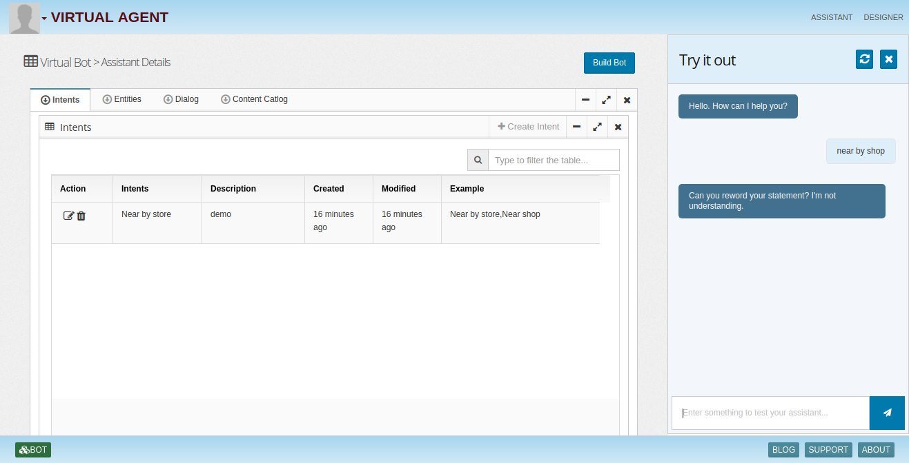

# Virtual-Agent-Framework
Virtual agent framework

AI based virtual agents/chat-bots are on the rise and providing great value to companies and customers. Innovation in speech synthesis, natural language processing and deep learning coupled with availability of large data sets, storage and compute power made it possible to build super smart virtual agents, which optimize over time with self learning.

At InsightLake we built a comprehensive AI based data platform, which allows companies to build advanced data applications like Smart Virtual Agents etc.

InsightLake platform provides following functionalities to build robust agents:

Collect data using many connectors, crawlers etc.
Process and store clean and standardize data sets. (Data Management)
Models (Machine learning & Deep learning models)
Rules
Knowledge Graphs & Reasoning
Natural Language Processing & Generation
Text to speech and speech to text
Agents - Intents, Entities & Dialog Management
Mobile & Web framework for agents
SIP (VOIP) based call agents

Deployment
Agents can be built and managed through InsightLake's web Console and deployed on websites, mobile apps and call center.
## Assistant Deatils
* Intents

* Entities

* Dialog

* Content Catalog

* Try It Bot

## Assistant View

* Assistants View

* Skills View

## Designer View

* Customize Dialog

Website - Chat/Voice
Mobile - Chat/Voice
VOIP Call Agent - Voice
Types of Agents
Deep Knowledge Agent
These agents learn from the data and build knowledge graphs. Users can ask questions and get answers. Few examples of these type of agents, which we can build on InsightLake platform.

FAQ - Point crawlers to websites and allow users to ask questions and get answers instead of searching through FAQs, Policies etc.
Confluence/Sharepoint Agent - Build an in-house knowledge agent so employees can simply ask questions to find out details.
JIRA/Rally Agent - Allows PMs or teams to find out details quickly.
Admin Agent
These agents allow administrators to perform various tasks like queries, running tasks, workflows, models etc.

Business User Agent
These agents allow business users to gather intelligence from data or documents using business level natural English language.

KYC Agent
These agents help KYC (Know your customer) or care teams to quickly find out details about customers, trends, patterns etc.

Agents Powered By Customer 360
One of the most popular data application of InsightLake platform is Customer 360. Once we have built standardized Customer data sets then we can easily plug Customer centric virtual agent to 360 datasets and allow customers to search and get details from their data (attributes, interactions, trends, customer journey).

Example : Customers can ask when did I have Thai food? When was my last payment posted? Am I spending too much on travel? Am I exercising enough for my age group? Many of such questions can be asked easily, which will empower customers and improve customer experience.

Conclusion
As virtual agents are getting smarter, they provide a great value to companies and customers. Companies can reduce their customer care costs and improve customer experience. InsightLake enables companies to build a smart data lake and exciting data centric applications like AI based agents.

To learn more, check out [http://www.insightlake.com/virtual-agents.html](http://www.insightlake.com/virtual-agents.html)

Installation
------
* Download or clone the repository. 
* Run bin/insightlake command.
* Open browser with URL as http://localhost:8080/
* Change configuration in /conf folder to set different ports
* By default H2 database is used, you can change the database details in jdbc.properties file

Installation using docker 
------
* Download or clone the repository. 
* cd /docker
* Run `docker-compose -f docker-compose.yaml up --build`
* Open browser with URL as http://localhost:8080/

License
------
InsightLake Virtual Agent Framework is a commercial product but distributed to be used freely. Please contact contact@insightlake.com for details.

Getting Help
----------

You can get help easily :
Community - Google Groups
Slack Channel
Twitter
Facebook
Email: contact@insightlake.com
